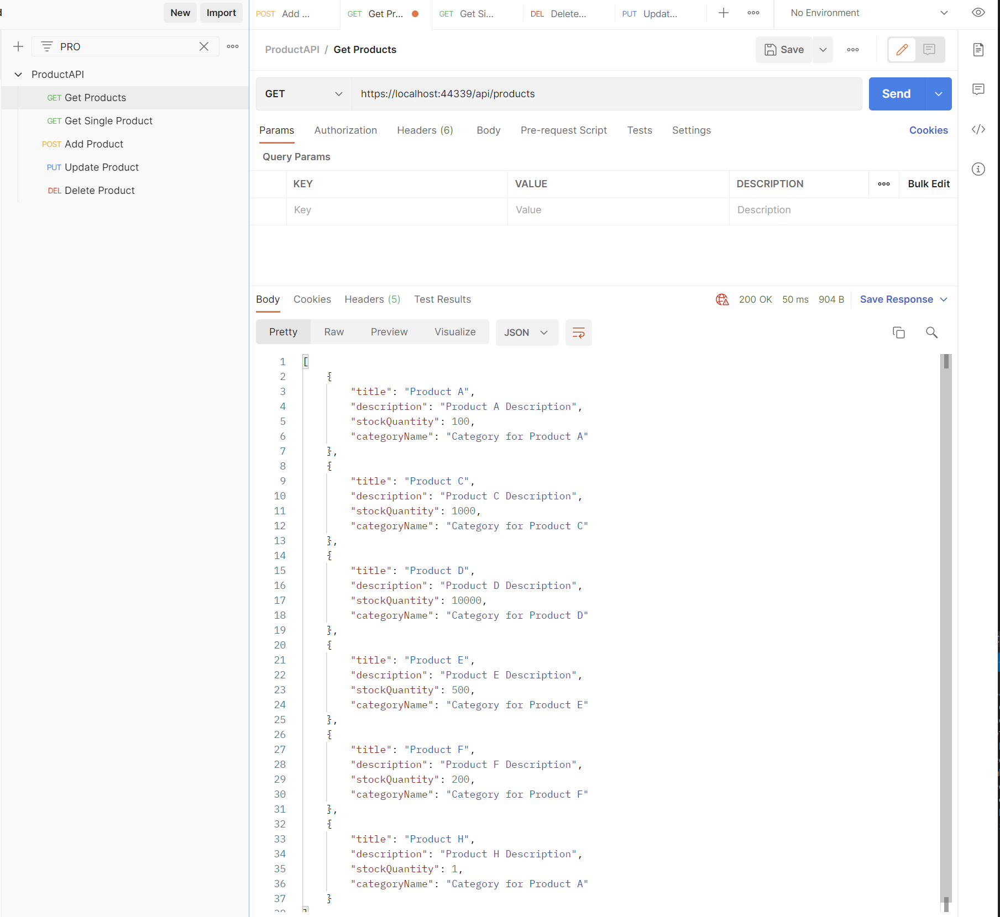

# Simple CRUD ASP.NET Core WebApi Sample with Metrics

In this repository you can find a simple ASP.NET Core application with rest endpoint. Also using Prometheus Metrics to monitoring.

This repository contains a controller which is dealing with Products. You can GET/POST/PUT/ELETE them.


See the examples here: 

## GET all Products

``` https://localhost:44339/api/products ```



## GET All Products with query parameters

``` https://localhost:44339/api/products?keyword=A&MinQuantity=100&MaxQuantity=2000 ```


## GET Single Product

``` https://localhost:44339/api/products/5 ```


## POST a Product

```https://localhost:44339/api/products ```

```javascript
  {
    "Title":"Test product title",
    "Description":"Test product Description",
    "StockQuantity":1234,
    "CategoryId":3
  }
```


## PUT a Product

``` https://localhost:44339/api/products/5 ```

``` javascript
{
    "Title":"Product E updated",
    "Description":"Product E Description updated",
    "StockQuantity":3234,
    "CategoryId":4
}
```


## DELETE a Product

``` https://localhost:44339/api/products/6 ```


## Metrics
To access metrics you can use below url
``` https://localhost:44339/metrics ```